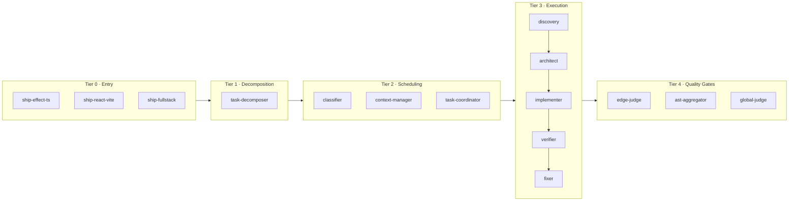
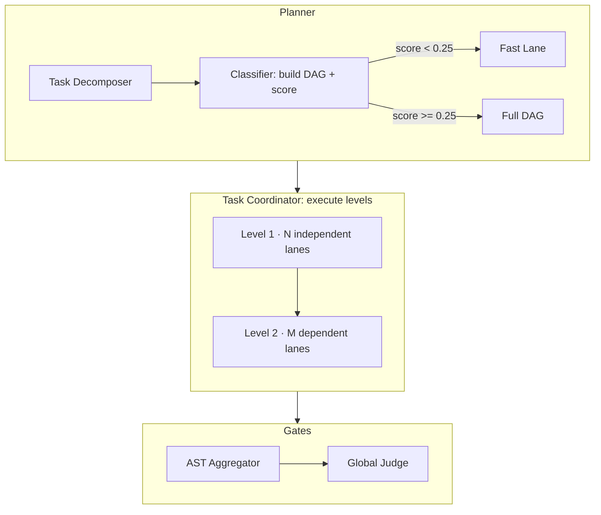
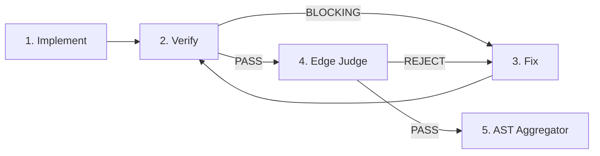
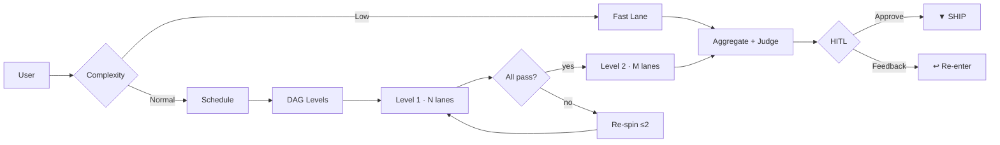

# nyx

Defining the latent capabilities of an invisible agent through structured, verifiable pipelines.

## Myths & Reality

| Myth | Reality |
|---|---|
| "It's just autocomplete." | 5 tiers gate every line before it hits your codebase. DAG schedule -> domain verify -> syntax gate -> conflict-free merge -> requirement cross-reference -> human confirm. No unchecked writes. |
| "It's just hallucinating with style." | Every agent outputs structured JSON with `file:line` citations. Every mutation traces to a requirement. Claims without evidence get rejected. Period. |
| "More agents = more failure modes." | DAG guarantees ordering: independent lanes parallel, dependent lanes wait. Atomic split = zero overlap. Collisions caught at AST Aggregator. Re-spins capped at 2. More gates, not more chaos. |
| "You still have to babysit it." | HITL at the final gate. Feedback routes to the right stage automatically - implementer for wrong logic, architect for wrong structure, verifier for edge cases. Max 3 loops, then it pauses. You direct, not babysit. |
| "I'm not letting AI touch my codebase." | No single agent writes unchecked. Every change passes verification layers before reaching your files. Verifier + Edge Judge + Global Judge are dedicated quality gates. Read-only until approved. |
| "It's just a code generator." | It's a full engineering pipeline: discovery (map unknown codebases), architecture (design with tradeoffs), verification (pattern-based review), and fixing (targeted resolution from verifier findings). Code generation is the last step, not the only step. |

---

## Mathematical Guarantees

### Scheduling
$$G = (V, E) \qquad L_k = \{\, v \in V \mid \max_{u \to v \in E} \text{depth}(u) = k \,\}$$
$$\text{DAG is acyclic by construction (P1–P7). Every dependency resolved before consumer.}$$

### Merge
$$\forall\, L_i, L_j \in \text{level}_k : \text{files}(L_i) \cap \text{files}(L_j) = \varnothing$$
$$\text{Disjoint targets → zero merge conflicts. Coupled → pre-node (P7).}$$

### Termination
$$\text{re\_spins} \leq 2,\quad \text{fix\_cycles} \leq 2,\quad \max = 4 \implies \text{UNRESOLVABLE\_ANOMALY}$$
$$\text{Fast Lane: } 0 \text{ re-spins. Every lane terminates in } \leq 4 \text{ rounds.}$$

### Complexity Routing
$$\Delta_i \in \{0.5, 1.0, 2.0, 3.0\} \qquad p_i = \frac{\Delta_i}{\sum \Delta_j}$$
$$H(T) = -\sum p_i \log_2 p_i \qquad H_{\text{norm}} = \frac{H(T)}{\log_2 n}$$
$$D_{\text{JS}} = \tfrac{1}{2} D_{\text{KL}}(P_A \parallel M) + \tfrac{1}{2} D_{\text{KL}}(P_B \parallel M) \qquad I_{\max} = \max_{j \neq k} I(U_j; U_k)$$
$$C(T) = \tfrac{1}{3} H_{\text{norm}} + \tfrac{1}{3} D_{\text{JS}} + \tfrac{1}{3} I_{\text{norm}}$$
$$\text{Fast Lane: } C(T) < \tau = 0.25 \;\land\; |T| = 1 \;\land\; |\text{files}| \leq 2 \quad (\texttt{!quick} \implies C(T) = 0)$$

### Ship Confidence
$$C_{\text{cit}} = \frac{\text{cited}}{\text{total}} \qquad C_{\text{ver}} \in \{1.0, 0.5, 0.0\} \qquad C_{\text{gj}} = \frac{\text{integrity}}{100}$$
$$C = \tfrac{1}{3} C_{\text{cit}} + \tfrac{1}{3} C_{\text{ver}} + \tfrac{1}{3} C_{\text{gj}}$$
$$\text{Decision: } \begin{cases} C \geq 0.80 & \text{Ship} \\ 0.50 \leq C < 0.80 & \text{Ship with caveats} \\ C < 0.50 & \text{Escalate} \end{cases} \qquad \text{Missing component } \implies w_i = 1/k$$

### Workflow Rollup
$$C_{\text{workflow}} = \frac{1}{N} \sum_{i=1}^{N} C_i$$
$$\text{Classification: } \begin{cases} C_{\text{wf}} \geq 0.80 & \text{HIGH} \\ 0.50 \leq C_{\text{wf}} < 0.80 & \text{MEDIUM} \\ C_{\text{wf}} < 0.50 & \text{LOW} \\ \text{Any FAILED or file overlap} & \text{BLOCKED} \end{cases}$$

---

## How It Works

### Architecture: 5 Tiers

### Width: DAG Scheduling

### Depth: Per-Lane Pipeline

### End-to-End Flow

## Key Design Properties

### Scheduling & Structure
| Property | Description |
|---|---|
| **DAG-driven scheduling** | No file-count thresholds. Classifier builds dependency graph from flat decomposition. Task Coordinator executes level by level, parallelizing independent lanes. |
| **Fast Lane routing** | Complexity pre-scoring (entropy model, τ = 0.25). Simple single-file tasks skip discovery, architect, verifier-pair, edge-judge, aggregation, and global-judge. Auto-apply for diffs ≤ 10 lines. |
| **Context tiering** | Read access graduated by agent role - Tier 1 (signatures, ≤1K), Tier 2 (types + imports, ≤2K), Tier 3 (full files, ≤4K), Diff-only (verifier, fixer, edge-judge). |
| **Atomic split** | Each lane targets one file cluster, one scope, zero overlap. Dehydrated context (signatures only, ≤2K tokens) keeps workers focused. |

### Quality & Safety
| Property | Description |
|---|---|
| **Build/Lint is absolute truth** | `npx tsc --noEmit` and `npx eslint` define correctness. Domain skill guidance is advisory. Code that compiles and passes lint ships; non-compiling code never ships. |
| **Lane pipeline** | `Implement -> Verify ⇄ Fix -> Edge Judge -> (PASS -> aggregate)`. Verifier flags correctness/boundary/citation issues; Fixer resolves them. Edge Judge gates syntax, scope, data-hollowing, and build/lint. |
| **Re-spin protocol** | Verifier BLOCKING -> Fixer re-runs. Edge Judge REJECT -> Fixer re-spin. Max 2 per lane. Max 2 fix cycles total. 3rd = UNRESOLVABLE_ANOMALY. Fast Lane has 0 re-spins. |
| **4K token sandbox** | Every worker receives ≤4,000 tokens. Prevents context drift and hallucination. |
| **Citation enforcement** | ≥60% of claims must include `file:line` evidence. Below = automatic rejection. |

### Traceability & Control
| Property | Description |
|---|---|
| **Session persistence** | State written to `.opencode/session-state_<YYYY-MM-DD>_<task-slug>.json` - tracks DAG progress, tier violations, HITL feedback, and final verdict. |
| **HITL with smart re-entry** | Mandatory human decision at the final gate. Feedback routes to the correct stage via routing tables. Max 3 loops; geometric decay model tracks stability. |
| **Formal confidence scoring** | Decision confidence computed as C = ⅓·C_cit + ⅓·C_ver + ⅓·C_gj. C ≥ 0.80 = HIGH (ship). C < 0.50 = LOW (escalate). |
| **Streaming aggregation** | Task coordinator aggregates as lanes complete. Cross-task conflict checks between batches of 10. |

## Tiers

| Tier | Responsibility | Agents |
|---|---|---|
| 0 - Entry | Workflow entrypoints | `ship-effect-ts`, `ship-react-vite`, `ship-fullstack` |
| 1 - Decomposition | Task decomposition, domain routing, HITL | `task-decomposer` |
| 2 - Scheduling | DAG construction, complexity scoring, context enforcement, execution | `classifier`, `context-manager`, `task-coordinator` |
| 3 - Execution | Discovery, architecture, implementation, verification, fixing | `effect-ts-*`, `react-vite-*`, `verifier`, `fixer` |
| 4 - Quality Gates | Syntax/scope gate, merge, cross-reference | `edge-judge`, `ast-aggregator`, `global-judge` |

## Domains

| Mode | Scope | Verification |
|---|---|---|
| `ship-effect-ts` | Backend (Effect-TS) | `verifier` with `domain: effect-ts` → loads `effect-ts` + `effect-ts-anti-patterns` |
| `ship-react-vite` | Frontend (React 19+ / Vite 8+) | `verifier` with `domain: react-vite` → loads `react-vite-conventions` + `react-vite-anti-patterns` |
| `ship-fullstack` | Cross-domain (both) | `verifier` per domain + `fullstack-boundary` for type contract checks |

## Domain Agents

| Domain | Discovery | Architect | Implementer | Orchestrator |
|---|---|---|---|---|
| effect-ts | `effect-ts-discovery` | `effect-ts-architect` | `effect-ts-implementer` | `effect-ts-ship` |
| react-vite | `react-vite-discovery` | `react-vite-architect` | `react-vite-implementer` | `react-vite-ship` |

## Gate Agents

| Gate | Agent | Pipeline Position |
|---|---|---|
| Verification (unified) | `verifier` (loads domain skills dynamically) | After implementer |
| Issue resolution | `fixer` (loads domain+concern skills) | After verifier flags blocking issues |
| Syntax/scope/build gate | `edge-judge` | After fixer; runs `tsc --noEmit` + `eslint` |
| Patch merge | `ast-aggregator` | After each level completes |
| Integrity cross-reference | `global-judge` | After all levels; integrity score ≥ 70 threshold |
