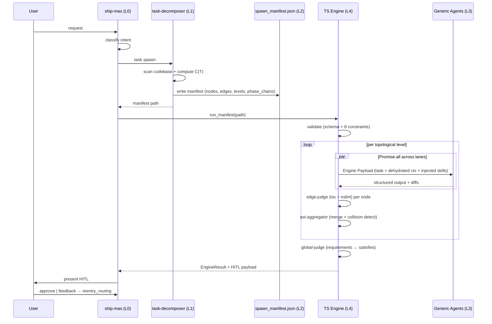
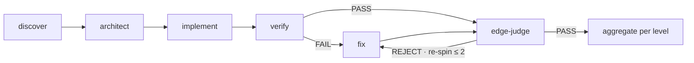
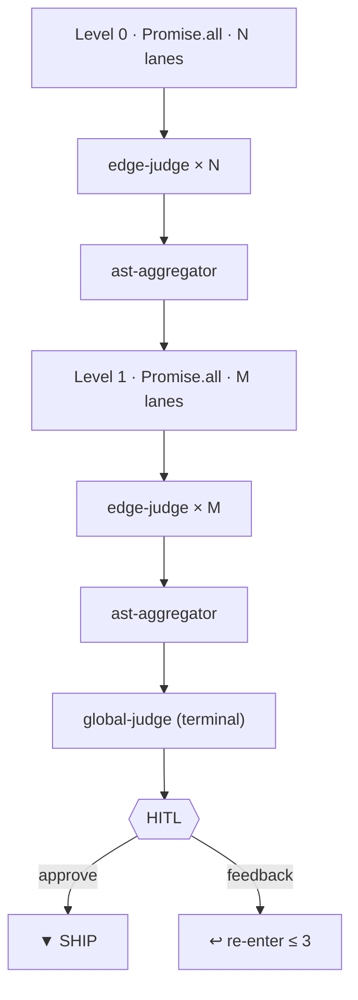

# nyx

A deterministic TypeScript engine orchestrates generic LLM agents through a declared manifest contract. Mechanical gates enforce correctness before any write reaches your codebase. The LLM is the semantic periphery; the control flow is pure TypeScript.

## Myths & Reality

| Myth | Reality |
|---|---|
| "It's just autocomplete." | The TS Engine is the control layer — pure TypeScript. It validates the manifest (AJV + 8 cross-document constraints), dehydrates context, dispatches agents via `Promise.all` per topological level, then runs mechanical gates (`tsc --noEmit` + `eslint`, AST merge, coverage map) before HITL. LLM never touches control flow. |
| "It hallucinates with style." | All 5 generic agents have `skill: deny` and `bash: deny` — they hold NO intrinsic domain knowledge. Skills are injected mechanically via the Engine Payload. Verifier output is parsed as JSON; `citation_coverage < 60%` → verdict FAIL. |
| "More agents = more failure." | The decomposer declares the DAG; the engine executes verbatim. 3 of 5 gates are pure TypeScript (`edge-judge`, `ast-aggregator`, `global-judge`), not LLM. Re-spins capped at 2; on exhaustion → `UNRESOLVABLE_ANOMALY`. |
| "You still have to babysit it." | HITL at the final gate. Feedback classified per `mas-feedback` → `reentry_routing` (architect / implement / verify / redecompose). Max 3 loops; geometric decay (`δ₄ < 0.07·δ₀`); pause on 4th. |
| "AI touching my codebase." | Only `verifier` is an LLM gate. `edge-judge`, `ast-aggregator`, `global-judge` are pure TypeScript. Agents are read-only until the engine approves the consolidated patch. |
| "It's just a code generator." | Full pipeline per node: `discover → architect → implement → verify → fix → gate`. Generation is the last step, not the only one. |

---

## Mathematical Guarantees

### Scheduling
$$G = (V, E) \qquad L_k = \{\, v \in V \mid \max_{u \to v \in E} \text{depth}(u) = k \,\}$$
$$\text{DAG acyclic by construction (P1–P7). Engine runs Promise.all per level.}$$

### Merge
$$\forall\, L_i, L_j \in \text{level}_k : \text{files}(L_i) \cap \text{files}(L_j) = \varnothing$$
$$\text{Disjoint targets → zero merge conflicts. Coupled → pre-node (P2) or type-contract edge (P5).}$$

### Termination
$$\text{re-spins} \leq 2 \text{ (full\_dag)},\ 0 \text{ (fast\_lane)} \implies \text{exhaustion} \to \text{UNRESOLVABLE\_ANOMALY}$$
$$\text{HITL loops} \leq 3;\ \delta_4 < 0.07\,\delta_0 \implies \text{pause at 4th}$$

### Complexity Routing
$$\Delta_i \in \{0.5, 1.0, 2.0, 3.0\} \qquad p_i = \frac{\Delta_i}{\sum \Delta_j} \qquad H_{\text{norm}} = \frac{-\sum p_i \log_2 p_i}{\log_2 n}$$
$$D_{\text{JS}} = \tfrac{1}{2} D_{\text{KL}}(P_A \parallel M) + \tfrac{1}{2} D_{\text{KL}}(P_B \parallel M) \qquad I_{\text{norm}} = \frac{\max_{j \neq k} I(U_j; U_k)}{H(T)}$$
$$C(T) = \tfrac{1}{3} H_{\text{norm}} + \tfrac{1}{3} D_{\text{JS}} + \tfrac{1}{3} I_{\text{norm}}$$
$$\text{Fast Lane: } C(T) < \tau = 0.25 \;\land\; |T| = 1 \;\land\; |\text{files}| \leq 2 \quad (\texttt{!quick} \implies C(T) = 0)$$

### Ship Confidence
$$C = \tfrac{1}{3} C_{\text{cit}} + \tfrac{1}{3} C_{\text{ver}} + \tfrac{1}{3} C_{\text{gj}} \qquad C_{\text{cit}} = \tfrac{\text{cited}}{\text{total}},\ C_{\text{ver}} \in \{1, 0.5, 0\},\ C_{\text{gj}} = \tfrac{\text{integrity}}{100}$$
$$\text{Decision: } \begin{cases} C \geq 0.80 & \text{Ship} \\ 0.50 \leq C < 0.80 & \text{Caveats} \\ C < 0.50 & \text{Escalate} \end{cases} \quad C_{\text{wf}} = \tfrac{1}{N}\sum C_i \to \text{HIGH / MEDIUM / LOW / BLOCKED}$$

---

## How It Works

### Control Flow

The engine is a **dumb pipe**: it executes exactly what the manifest declares — no LLM routing, no LLM classification, no LLM context management. The decomposer **declares** (nodes, edges, levels, phase chains, skills, budgets); the engine **executes verbatim**.

### Per-Node Phase Chain

Fast Lane trims to `implement → edge-judge` (`max_respins: 0`).

### DAG Levels

---

## Key Design Properties

| Property | Description |
|---|---|
| **DAG-driven scheduling** | Decomposer declares `nodes[]`, `edges[]`, `levels[]`; engine executes verbatim via `Promise.all()` per topological level. No file-count thresholds. |
| **Fast Lane** | `C(T) < 0.25 ∧ 1 task ∧ ≤ 2 files` (or `!quick`) → 2-phase chain, `max_respins: 0`. Auto-apply when diff ≤ 10 lines and no new exports. |
| **Context tiering** | Dehydrator graduates read access by phase — Tier 1 (signatures), Tier 2 (types + imports), Tier 3 (full ≤ 4K), Diff-only (verifier, fixer). Enforced via `context_budget.max_tokens`. |
| **Atomic split** | One node = one file cluster, one scope, zero overlap. Coupled → synthetic pre-node (P2) or `type_contract_dependency` edge (P5). |
| **Build/Lint is absolute truth** | `edge-judge` runs `tsc --noEmit` + `eslint` mechanically. Domain skill guidance is advisory (NON_BLOCKING). Non-compiling code never ships. |
| **Re-spin protocol** | Edge-judge REJECT → fixer re-spin. `max_respins = 2` (full_dag), `0` (fast_lane). Exhaustion → `UNRESOLVABLE_ANOMALY`. |
| **4K token sandbox** | `context_budget.max_tokens` enforced per phase by the Dehydrator. |
| **Citation enforcement** | `citation_coverage.meets_threshold` requires ≥ 60% `file:line` evidence. Below → verifier FAIL. |
| **Workspace isolation** | Global `~/.config/opencode/` is read-only (agents, schemas, skills, plugins). Local `./.opencode/` is read-write (`manifests/`, `runs/`). Strict project isolation. |
| **Mechanical gates** | `edge-judge` (per node), `ast-aggregator` (per level), `global-judge` (terminal) — all pure TypeScript, no LLM involvement in gating. |

---

## Layers

| Layer | Role | Components |
|---|---|---|
| **L0 — Human Interface** | Classify intent, spawn decomposer, invoke engine, present HITL | `ship-mas` mode (only `task` + `run_manifest` tools) |
| **L1 — Manifest Producer** | Decompose, score complexity, build DAG, write manifest (STRICTLY JSON) | `task-decomposer` (sole non-deterministic seam) |
| **L2 — The Contract** | Declare routing, phase chains, skill injections, budgets | `spawn_manifest.json` (validates against `spawn-manifest.schema.json`) |
| **L3 — Semantic Periphery** | Generic LLM agents — no intrinsic domain knowledge; skills injected via Engine Payload | `discovery`, `architect`, `implementer`, `verifier`, `fixer` |
| **L4 — Mechanical Core** | Validate, dehydrate, dispatch per level, run gates — pure TypeScript | TS Engine: `Validator`, `Dehydrator`, `Spawn Bridge`, `edge-judge`, `ast-aggregator`, `global-judge` |

## Domains & Skills

A domain is a **node property** (`node.domain`), not a separate mode. The engine injects skills declared in each node's `phase_chain[].skills[]` at runtime — the 5 generic agents serve all domains.

| Domain | Base skills injected |
|---|---|
| `effect-ts` | `effect-ts-code-conventions`, `effect-ts-anti-patterns` |
| `react-vite` | `react-vite-conventions`, `react-vite-anti-patterns` |
| `shared` | both bases + `fullstack-boundary` |

Concern-driven layering by the decomposer:

| Concern | Additional skills |
|---|---|
| error-handling | `effect-ts-error-handling` / `react-vite-error-handling` |
| performance | `react-vite-performance` |
| concurrency | `effect-ts-concurrency` |
| resource-lifecycle | `effect-ts-resource-layer` |
| data-validation | `effect-ts-schema` |
| principle-check | `effect-ts-principle-thinking` |
| architecture / DDD | `effect-ts-design-patterns` + `effect-ts-principle-thinking` |

`mas-*` conceptual skills (`mas-architecture`, `mas-routing`, `mas-workflow`, `mas-complexity-scoring`, `mas-fast-path`, `mas-integrity`, `mas-aggregation`, `mas-decision`, `mas-feedback`, `mas-interrupts`) define topology, routing, scoring, and HITL rules for the decomposer and ship-mas mode.

## Gates

| Gate | Type | Module | Position |
|---|---|---|---|
| Verification | LLM | `verifier` (JSON verdict; skills injected) | After implementer |
| Issue resolution | LLM | `fixer` (skills injected) | After verifier BLOCKING / edge-judge REJECT |
| Syntax / scope / build | Mechanical | `edge-judge` — `tsc --noEmit` + `eslint` + scope-escape + data-hollowing | Per node |
| Patch merge | Mechanical | `ast-aggregator` — diff merge + collision detection | Per level |
| Integrity coverage | Mechanical | `global-judge` — requirements ↔ satisfies coverage map | Terminal |
