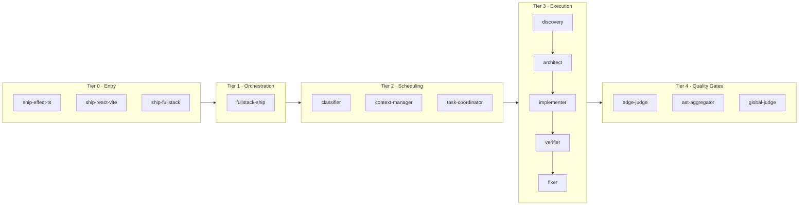
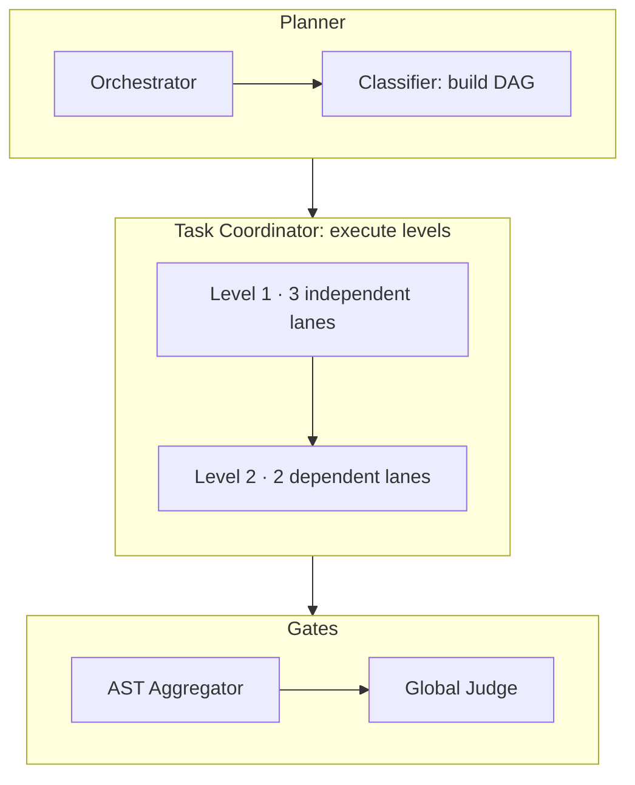
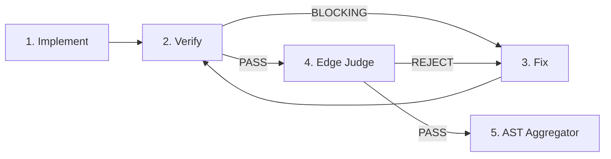
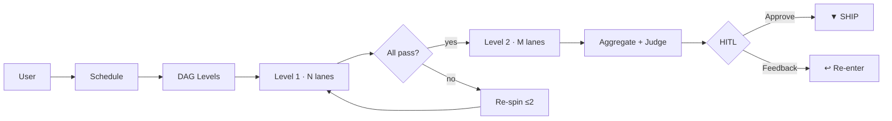

# nyx

Defining the latent capabilities of an invisible agent through structured, verifiable pipelines.

## Myths & Reality

| Myth | Reality |
|---|---|
| "It's just autocomplete." | 5 tiers gate every line before it hits your codebase. DAG schedule -> domain verify -> syntax gate -> conflict-free merge -> requirement cross-reference -> human confirm. No unchecked writes. |
| "It's just hallucinating with style." | Every agent outputs structured JSON with `file:line` citations. Every mutation traces to a requirement. Claims without evidence get rejected. Period. |
| "More agents = more failure modes." | DAG guarantees ordering: independent lanes parallel, dependent lanes wait. Atomic split = zero overlap. Collisions caught at AST Aggregator. Re-spins capped at 2. More gates, not more chaos. |
| "You still have to babysit it." | HITL at the final gate. Feedback routes to the right stage automatically - implementer for wrong logic, architect for wrong structure, verifier for edge cases. Max 3 loops, then it pauses. You direct, not babysit. |
| "I'm not letting AI touch my codebase." | No single agent writes unchecked. Every change passes 5 verification layers before reaching your files. Verifier + Edge Judge + Global Judge are dedicated quality gates. Read-only until approved. |
| "It's just a code generator." | It's a full engineering pipeline: discovery (map unknown codebases), architecture (design with tradeoffs), verification (pattern-based JSON review), and fixing (targeted resolution from verifier findings). Code generation is the last step, not the only step. |

---

## How It Works

### Architecture: 5 Tiers

### Width: DAG Scheduling

The Classifier builds a dependency DAG from the decomposed task set. The Task Coordinator executes one level at a time - all lanes in a level run in parallel, and levels advance sequentially.

### Depth: Per-Lane Pipeline

Every lane (regardless of domain) runs the same 5-stage chain. The Verifier and Edge Judge act as gates, each with a dedicated Fixer re-spin loop.

### End-to-End Flow

## Key Design Properties

### Scheduling & Structure
| Property | Description |
|---|---|
| **DAG-driven scheduling** | No file-count thresholds. Classifier builds a dependency graph. Task Coordinator executes level by level, parallelizing independent lanes. |
| **Context tiering** | Read access graduated by agent role - Tier 1 (signatures, ≤1K), Tier 2 (types + imports, ≤2K), Tier 3 (full files, ≤4K), Diff-only (verifier, fixer, edge-judge). |
| **Atomic split** | Each lane targets one file cluster, one scope, zero overlap. Dehydrated context (signatures only, ≤2K tokens) keeps workers focused. |

### Quality & Safety
| Property | Description |
|---|---|
| **Lane pipeline** | `Implement -> Verify ⇄ Fix -> Edge Judge -> (PASS -> aggregate)`. Verifier flags correctness/boundary/citation issues; Fixer resolves them. Edge Judge gates syntax, scope, and data-hollowing. |
| **Re-spin protocol** | Verifier BLOCKING -> Fixer re-runs. Edge Judge REJECT -> Fixer re-spin. Max 2 per lane. 3rd escalation = pause and flag. |
| **4K token sandbox** | Every worker receives ≤4,000 tokens of context. Prevents context drift and hallucination. |
| **Citation enforcement** | ≥60% of claims must include `file:line` evidence. Below threshold = automatic rejection. |

### Traceability & Control
| Property | Description |
|---|---|
| **Session persistence** | State written to `.opencode/session-state_<YYYY-MM-DD>_<task-slug>.json` - tracks DAG progress, tier violations, HITL feedback, and final verdict. One file per task, no overwrites. |
| **HITL with smart re-entry** | Mandatory human decision at the final gate. Feedback routes to the correct stage via routing tables - implementer for wrong behavior, architect for wrong design, verifier for missed edge cases. Max 3 loops. |

## Tiers

| Tier | Responsibility | Agents |
|---|---|---|
| 0 - Entry | Workflow entrypoints | `ship-effect-ts`, `ship-react-vite`, `ship-fullstack` |
| 1 - Orchestration | Task decomposition, routing | `fullstack-ship` |
| 2 - Scheduling | DAG construction, context enforcement, execution control | `classifier`, `context-manager`, `task-coordinator` |
| 3 - Execution | Discovery, architecture, implementation, verification, fixing | `effect-ts-*`, `react-vite-*`, `verifier`, `fixer` |
| 4 - Quality Gates | Syntax/scope gate, merge, cross-reference | `edge-judge`, `ast-aggregator`, `global-judge` |

## Domains

| Mode | Scope | Verification |
|---|---|---|
| `ship-effect-ts` | Backend (Effect-TS) | `verifier` with `domain: effect-ts` |
| `ship-react-vite` | Frontend (React 19+ / Vite 8+) | `verifier` with `domain: react-vite` |
| `ship-fullstack` | Cross-domain (both) | `verifier` per domain + boundary check |
