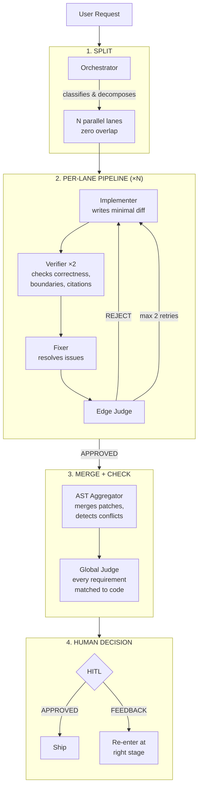

# nyx

Defining the latent capabilities of an invisible agent through structured, verifiable pipelines.

## Myths & Reality

| Myth | Reality |
|---|---|
| "It just generates code directly." | Every change passes through **implement → verify ×2 → fix → judge → aggregate → global check → human confirm**. No single agent writes to your codebase unchecked. |
| "It's a black box - I don't know what changed or why." | Every agent outputs structured evidence with `file:line` citations (≥60% enforced). State is persisted in `.opencode/session-state.md`. Every mutation is traceable back to a requirement. |
| "More agents = more chaos." | Atomic split guarantees zero overlap between parallel lanes. Collisions are detected and resolved at the AST Aggregator layer. Re-spins are capped at 2 per lane. The system is designed for ordered parallelism, not entropy. |
| "AI doesn't need human review." | HITL is mandatory at the final stage. You confirm or reject. If you give feedback, it re-enters at the correct stage - not from scratch. Max 3 feedback loops before we pause. |
| "Large changes are too risky for AI." | The dynamic pipeline decomposes large work into N independent lanes running in parallel. Each lane is sandboxed (4K tokens max) and verified independently. Risk is bounded per lane, not accumulated across the whole change. |
| "This is just for writing code." | The MAS also handles **discovery** (understanding unknown codebases), **architecture** (design decisions with tradeoffs), **review** (verification against patterns), and **debugging** (targeted fix with root-cause analysis). |

---

## How It Works

### Key Design Properties

- **Atomic split**: Each lane targets one file cluster, one scope, zero overlap. Dehydrated context (no comments, signatures only, under 2K tokens) keeps workers focused.
- **Linear pipeline** (<5 files, coupled): `Discovery → Architect → Implementer → Verifier×2 → Fixer → Edge Judge → Aggregator → Global Judge → HITL`
- **Dynamic pipeline** (>10 files, independent): `Orchestrator → N×TaskCoordinator → Aggregator → Global Judge → HITL`
- **Re-spin protocol**: Edge Judge rejection triggers targeted fix (max 2/lane). 3rd escalation stops and flags.
- **4K token sandbox**: Every worker receives ≤4,000 tokens. Prevents context drift and hallucination.
- **Citation enforcement**: ≥60% of claims require `file:line` evidence. Below threshold = rejection.
- **Session persistence**: State written to `.opencode/session-state.md` for cross-session continuity.

### Domains

| Mode | Lane | Orchestrator |
|---|---|---|
| Backend (Effect-TS) | `effect-ts-ship` | Effect-TS agents |
| Frontend (React/Vite) | `react-vite-ship` | React/Vite agents |
| Both | `fullstack-ship` | Cross-domain + boundary contract check |

