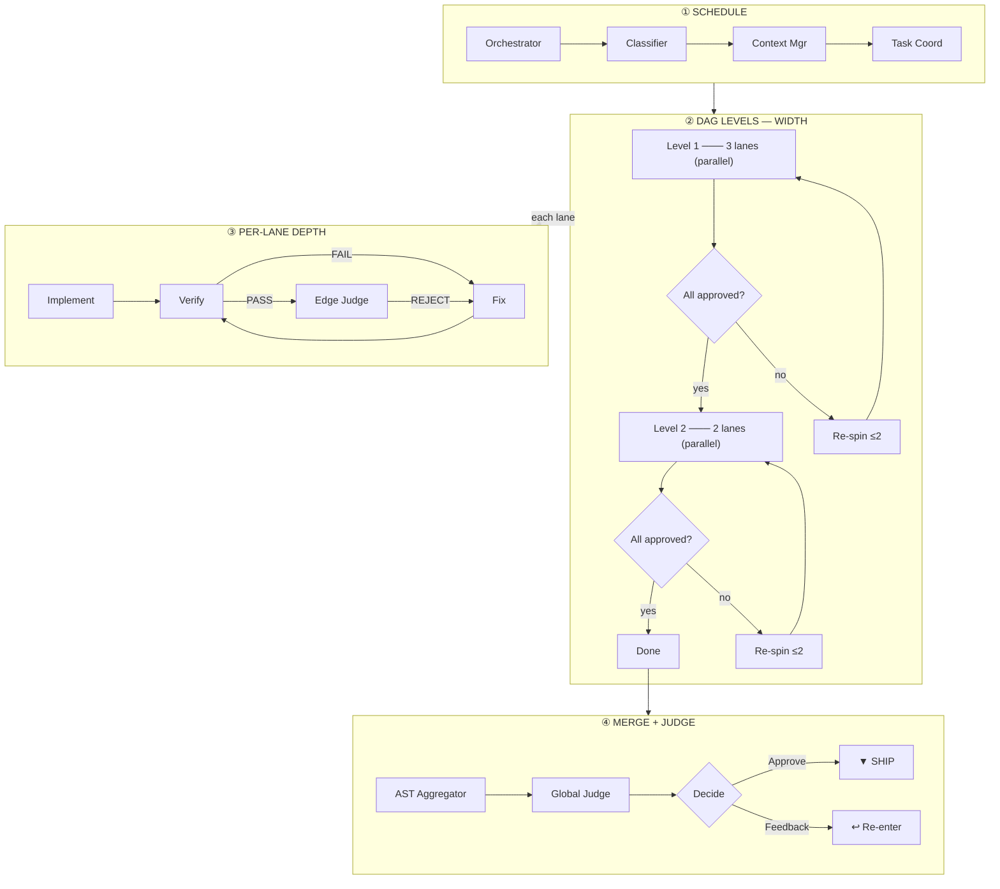

# nyx

Defining the latent capabilities of an invisible agent through structured, verifiable pipelines.

## Myths & Reality

| Myth | Reality |
|---|---|
| "It just generates code directly." | Every change passes through **decompose → schedule (DAG) → implement → verify → fix → judge → aggregate → global check → human confirm**. No single agent writes to your codebase unchecked. |
| "It's a black box - I don't know what changed or why." | Every agent outputs structured evidence with `file:line` citations (≥60% enforced). State is persisted in `.opencode/session-state_<task>.json`. Every mutation is traceable back to a requirement. |
| "More agents = more chaos." | Atomic split guarantees zero overlap between parallel lanes. DAG-based scheduling ensures correct ordering. Collisions are detected at AST Aggregator. Re-spins capped at 2 per lane. |
| "AI doesn't need human review." | HITL is mandatory at the final stage. You confirm or reject. Feedback re-enters at the correct stage via routing tables — not from scratch. Max 3 feedback loops before we pause. |
| "Large changes are too risky for AI." | Classifier builds a dependency DAG. Task Coordinator executes level by level: independent lanes run in parallel, dependent lanes wait. Each lane is sandboxed (4K tokens max). Risk is bounded per lane. |
| "This is just for writing code." | The MAS also handles **discovery** (understanding unknown codebases), **architecture** (design decisions with tradeoffs), **verification** (pattern-based review), and **debugging** (targeted fix with root-cause analysis). |

---

## How It Works

### Key Design Properties

- **DAG-driven scheduling**: No file-count thresholds. Classifier builds a dependency DAG. Task Coordinator executes level by level, parallelizing independent lanes.
- **Context tiering**: Context Manager enforces read tiers — Tier 1 (signatures, ≤1K), Tier 2 (types + imports, ≤2K), Tier 3 (full files, ≤4K), Diff-only (verifier/edge-judge).
- **Atomic split**: Each lane targets one file cluster, one scope, zero overlap. Dehydrated context (signatures only, under 2K tokens) keeps workers focused.
- **Lane pipeline**: `Implementer → Verifier (loop with Fixer) → Edge Judge → (APPROVED → aggregate)`
- **Re-spin protocol**: Verifier FAIL → fixer re-runs. Edge Judge REJECT → fixer re-spin (max 2/lane). 3rd escalation = pause.
- **4K token sandbox**: Every worker receives ≤4,000 tokens. Prevents context drift and hallucination.
- **Citation enforcement**: ≥60% of claims require `file:line` evidence. Below threshold = rejection.
- **Session persistence**: State written to `.opencode/session-state_<YYYY-MM-DD>_<task-slug>.json` for cross-session continuity.

### Tiers & Domains

| Tier | Responsibility | Agents |
|---|---|---|
| 0 — Entry | Workflow entrypoints | `ship-effect-ts`, `ship-react-vite`, `ship-fullstack` |
| 1 — Orchestration | Task decomposition, routing | `fullstack-ship` |
| 2 — Scheduling | DAG construction, context enforcement, execution control | `classifier`, `context-manager`, `task-coordinator` |
| 3 — Execution | Discovery, architecture, implementation, verification, fixing | `effect-ts-*`, `react-vite-*`, `verifier`, `fixer` |
| 4 — Quality Gates | Lint gate, merge, cross-reference | `edge-judge`, `ast-aggregator`, `global-judge` |

### Domains

| Mode | Scope | Verification |
|---|---|---|
| `ship-effect-ts` | Backend (Effect-TS) | `verifier` with `domain: effect-ts` |
| `ship-react-vite` | Frontend (React/Vite) | `verifier` with `domain: react-vite` |
| `ship-fullstack` | Cross-domain | `verifier` per domain + boundary check |

